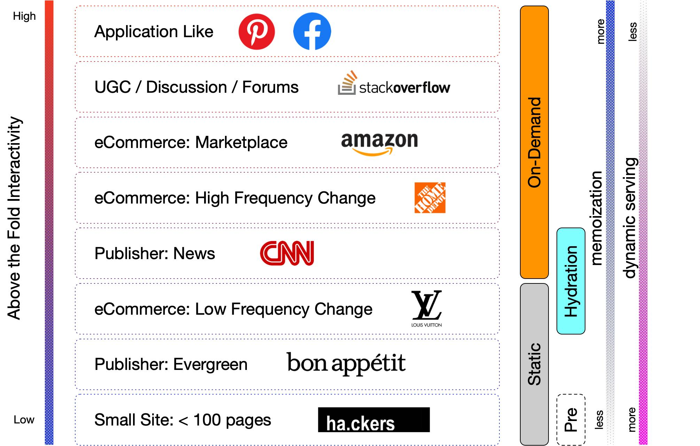
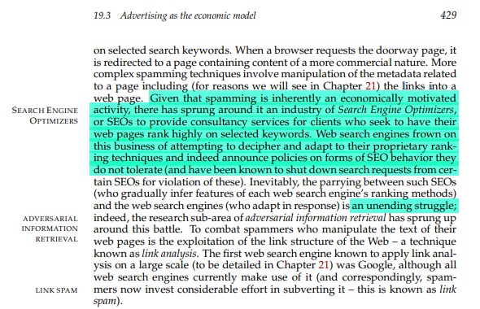
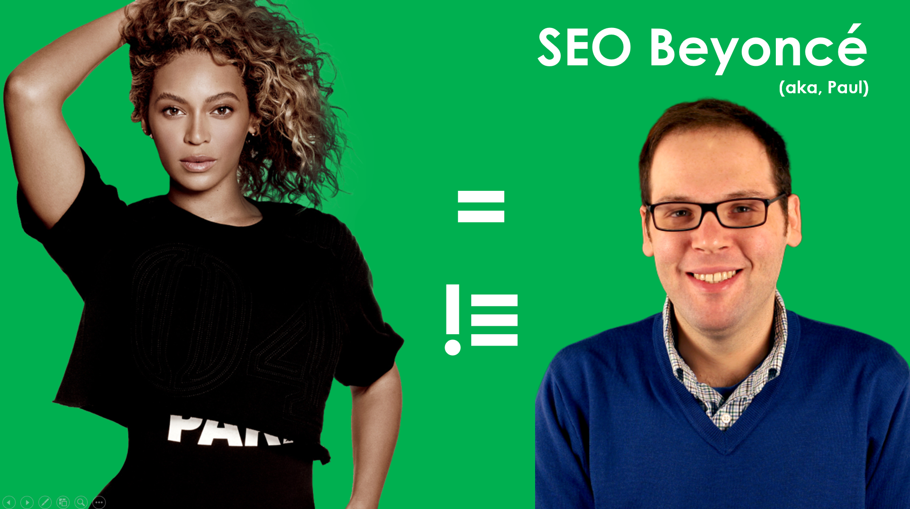

# Hello ~~World~~ Google Dev Meetup

<br />
<br />
<br />
<br />
<br />
<br />

I really wanted ya'll to feel comfortable... 

<br />
<br />
<br />
<br />
<br />
<br />

... so, I'm presenting this from GitHub as a PRESENTME.md

<br />
<br />
<br />
<br />
<br />
<br />

*(Hey, everyone has to have a secret talent,* 

<br />
<br />
<br />
<br />
<br />
<br />

*mine just happens to be markdown...*

<br />
<br />
<br />
<br />
<br />

*`silentTears(lackOfTalent)`)*

<br />
<br />
<br />
<br />
<br />
<br />
<br />
<br />
<br />
<br />
<br />
<br />
<br />
<br />
<br />

...`awkoTacoPause()`...

<br />
<br />
<br />
<br />
<br />
<br />
<br />
<br />
<br />
<br />
<br />
<br />
<br />
<br />
<br />


*Anyways*, let's get `started()`!

<br />
<br />
<br />
<br />

## **Question:** How many of you *like* doing SEO work?

<br />
<br />
<br />
<br />
<br />
<br />
<br />
<br />
<br />
<br />
<br />
<br />
<br />
<br />
<br />
<br />
<br />
<br />
<br />
<br />
<br />

**A response:** We know that 70%* of the work we ask devs to do can cause trauma, but we don't want it to. 

<br />
<br />
<br />
<br />
<br />
<br />
<br />
<br />
<br />
<br />
<br />
<br />

Most SEOs would rather do strategic, data-driven, and insightful work.

<br />
<br />
<br />
<br />
<br />
<br />
<br />
<br />
<br />
<br />
<br />
<br />
<br />
<br />
<br />

So, today, we're going to go through some ways we can improve our mutual happiness!

<br />
<br />
<br />
<br />
<br />
<br />
<br />
<br />
<br />

### Dev happiness + SEO happiness = friendship magic + successful online presence! ♥♥♥

<br />
<br />
<br />
<br />
<br />

### **♥♡♡ Progress:**

### ▓▓▓▓▓░░░░░░░░░░ 30% (for showing up today!)

<br />
<br />
<br />
<br />
<br />
<br />
<br />
<br />
<br />
<br />
<br />
<br />
<br />
<br />
<br />

# Ways to totally not be bothered by your SEO friends... 
## and maintain a healthy relationship!

<br />
<br />
<br />
<br />
<br />
<br />
<br />
<br />
<br />
<br />
<br />
<br />
<br />
<br />
<br />
<br />
<br />
<br />


## Automate out the suuuuper boring stuff (that should be done programmatically)

<br />
<br />
<br />
<br />
<br />
<br />
<br />
<br />
<br />
<br />
<br />
<br />

### 1. Add these into unit testing:

- [ ] link tags with canonical attributes (assert values they should be, we'll give a list!)
- [ ] meta robots tags (99.99% (repeating of course) should NOT have `noindex`)
- [ ] any Schema your site has (assert that it's there and what it should be)
- [ ] h1 tag 
- [ ] title tags
- [ ] meta descriptions
- [ ] XML sitemap (assert present and includes top KPI-driving URLs) 
- [ ] robots.txt (assert what it should be)

<br />
<br />
<br />
<br />
<br />
<br />
<br />
<br />
<br />
<br />
<br />
<br />
<br />
<br />
<br />

### 2. Automate:

- [ ] XML sitemap creation 
- [ ] image compression

<br />
<br />
<br />
<br />
<br />
<br />
<br />
<br />
<br />
<br />
<br />
<br />

### **♥♥♡ Progress:**

### ▓▓▓▓▓▓▓▓▓░░░░░░ 60%

<br />
<br />
<br />
<br />
<br />
<br />
<br />
<br />
<br />
<br />
<br />
<br />
<br />
<br />
<br />
<br />
<br />
<br />


## Things we *secretly* don't care about

<br />
<br />
<br />
<br />
<br />
<br />
<br />
<br />
<br />
<br />
<br />
<br />
<br />
<br />
<br />

### 3. 99%* of SEOs don't care what JS framework you use, just make sure bots can render it (we do care about that)
* if you want to not deal with hassle of prerendered pages, just commit to making it isomorphic/universal JS from the beginning
* biggest challenge with prerendered - if the prerendered versions break... it's hard to catch
* great chart by @eywu:



<br />
<br />
<br />
<br />
<br />
<br />
<br />
<br />
<br />
<br />
<br />
<br />
<br />
<br />
<br />


## Things we are **definitely** going to ask for

<br />
<br />
<br />
<br />
<br />
<br />
<br />
<br />
<br />
<br />
<br />
<br />
<br />
<br />
<br />

### 4. we're probably going to ask about Schema.org at some point

* if you have templates that are constant, just roll in microdata (wrap components)
* otherwise, just make a section for JSON-LD (it's a tiny baby `<script>`), so we can throw a baby script in there
	* **side note:** *I* would validate in the structured data testing tool whatever your team sends you (buuuut that's just because I have trust issues...)
    * **side note two:** if you use react think about rolling schema into a component (tip from my man @eywu)

<br />
<br />
<br />
<br />
<br />
<br />
<br />
<br />
<br />
<br />
<br />
<br />
<br />
<br />
<br />
<br />
<br />
<br />
	
### 5. we need a way to update the content on the site without bothering you. 
* give us some creative space, let our creative wings sour.... 
* ... maybe near the footer or something
	
<br />
<br />
<br />
<br />
<br />
<br />
<br />
<br />
<br />
<br />
<br />
<br />
<br />
<br />
<br />
<br />
<br />
<br />
	
### 6. we'll probably want a blog or thought-leadership-influencer-section of the site, just give us our creative

* it's probably easier to just add a site section with WP	

<br />
<br />
<br />
<br />
<br />
<br />
<br />
<br />
<br />
<br />
<br />
<br />

### **♥♥♡ Progress:**

### ▓▓▓▓▓▓▓▓▓▓▓░░░░ 70%

<br />
<br />
<br />
<br />
<br />
<br />
<br />
<br />
<br />
<br />
<br />
<br />
<br />
<br />
<br />

## Things most SEOs would appreciate

<br />
<br />
<br />
<br />
<br />
<br />
<br />
<br />
<br />
<br />
<br />
<br />
<br />
<br />
<br />


### 7. if you have access to any clean API data and can do some sort of mad-lib, computer generated text for useful information on pages 

* especially when there are many pages, we'll probably like it
* we want each page to have a purpose that is clear in its textual content
* visuals are becoming more important, buuuut most SEOs still focus a lot on textual content 

<br />
<br />
<br />
<br />
<br />
<br />
<br />
<br />
<br />
<br />
<br />
<br />
<br />
<br />
<br />
<br />
<br />
<br />

### 8. we're probably going to bother you about site speed (no matter how good it is)

* look at Google's lighthouse and the page speed insight tool and you'll get 80%* of what most SEOs will tell you
* use your SEO friend to start a war to remove tracking pixels from the site, let them fight for you
* tell them you refactor your code on a monthly basis
* find a way to remove any unused JS and CSS in production (invent a product that does this for all sites, become the next lesser-known Bill Gates)

<br />
<br />
<br />
<br />
<br />
<br />
<br />
<br />
<br />
<br />
<br />
<br />
<br />
<br />
<br />
<br />
<br />
<br />

### **♥♥♡ Progress:**

### ▓▓▓▓▓▓▓▓▓▓▓▓░░░ 80%

<br />
<br />
<br />
<br />
<br />
<br />
<br />
<br />
<br />
<br />
<br />
<br />
<br />
<br />
<br />


## Things we care a **lot** about and will probably lose our minds over... haha... haha... hahahahahahaa	

<br />
<br />
<br />
<br />
<br />
<br />
<br />
<br />
<br />
<br />
<br />
<br />
<br />
<br />
<br />
<br />
<br />
<br />


### 9. breathe with me.... okay... one more.... 301 redirects are the only valid redirect... ah... didn’t that feel good
* it did... (thank you past self for your encouraging words)

<br />
<br />
<br />
<br />
<br />
<br />
<br />
<br />
<br />
<br />
<br />
<br />
<br />
<br />
<br />


`break; // from crazy loop`

<br />
<br />
<br />
<br />
<br />
<br />
<br />
<br />
<br />
<br />
<br />
<br />
<br />
<br />
<br />

### 10. we care a lot about internal linking (think: main nav, footer, internal link) and the anchor text

<br />
<br />
<br />
<br />
<br />
<br />
<br />
<br />
<br />
<br />
<br />
<br />
<br />
<br />
<br />

### 11. we care a lot about duplication

<br />

```
# resolving duplicate content
 if (you can demolish page) {
	301 redirect page;
	}
 else if (you can't demolish page) {
	use canonical tags;
	}	
 else {
	get a new CMS;
	}
```

* side note: there could also be "duplicate content" generated from sites that have "thin" textual content
	* think about how the robots feel... for once, already
	* buuut seriously, just a URL, title tag, and heading tag are not enough to rank as the *best* result on the **entire** web

<br />
<br />
<br />
<br />
<br />
<br />
<br />
<br />
<br />
<br />
<br />
<br />


### **♥♥♡ Progress:**

### ▓▓▓▓▓▓▓▓▓▓▓▓▓░░ 90%

<br />
<br />
<br />
<br />
<br />
<br />
<br />
<br />
<br />
<br />
<br />
<br />
<br />
<br />
<br />


## Things we *kind* of care about (and will probably bother you about...)

<br />
<br />
<br />
<br />
<br />
<br />
<br />
<br />
<br />
<br />
<br />
<br />
<br />
<br />
<br />
<br />
<br />
<br />


### 12. we care a little about conversion optimization (b/c we can't stand getting traffic to the site and then it not converting!!)
* so, you'll probably hear some basic stuff from us like -> make CTA buttons on the top half of the page, make them a color that stands out...ya know, the basics

<br />
<br />
<br />
<br />
<br />
<br />
<br />
<br />
<br />
<br />
<br />
<br />
<br />
<br />
<br />
<br />
<br />
<br />
<br />
<br />
<br />


### 13. we also want to be on HTTPS (w/ HSTS of course), mostly because google said they use it as a ranking factor, buuut also because it's a more secure format that allows for the encryption of user's *probably private* browsing information
* other than HTTPS, most of us won't talk to you about XSS, SQL injections, DoS, etc.; we assume you got that (that's developer buddy)

<br />
<br />
<br />
<br />
<br />
<br />
<br />
<br />
<br />
<br />
<br />
<br />
<br />
<br />
<br />
<br />
<br />
<br />
<br />
<br />
<br />


### 14. if you have a lot of 3rd party writers, we'll want some system (like Yoast) that helps writers in their workflow

* literally just copying from Yoast (for WP plugin) tool...
    - [x] what is the primary keyword?
    - [ ] is primary keyword in the title tag?
    - [ ] is meta description added?
    - [ ] are images present? (cough... and optimized)
    - [ ] are internal links on the page?
    - [ ] does keyword density look reasonable for a human being?
    - [ ] relevant outbound links present?
    - [ ] is the content the recommended content length?
    - [ ] are there subheadings? (so we can all skim the content)
    - [ ] what is the ease of reading (Flesch)?
    - [ ] using active voice?
 

<br />
<br />
<br />
<br />
<br />
<br />
<br />
<br />
<br />
<br />
<br />
<br />
<br />
<br />
<br />
<br />
<br />
<br />

### **♥♥♥ Progress:**

### ▓▓▓▓▓▓▓▓▓▓▓▓▓▓░ 95%

<br />
<br />
<br />
<br />
<br />
<br />
<br />
<br />
<br />
<br />
<br />
<br />
<br />
<br />
<br />

               
# Things we want you to know about us, SEOs

<br />
<br />
<br />
<br />
<br />
<br />
<br />
<br />
<br />
<br />
<br />
<br />
<br />
<br />
<br />


### 1. we come from a ton of different backgrounds (business, development, music, writing, etc...)

* this means we *could potentially* be really hard to communicate w/, since you don't know what you're getting
* we probably know a lot about completely random things from black-box testing the crud out of the website, 
	* which may make our requirements spotty
		* tell us if we're being unclear (hold us accountable to being clear)
		* we will rely on your help with the white-box side of the site

<br />
<br />
<br />
<br />
<br />
<br />
<br />
<br />
<br />
<br />
<br />
<br />
<br />
<br />
<br />
<br />
<br />
<br />


### 2. in the past SEO and SEs used to not like each other (if you've read an IR textbook, you'll probably find a chapter on us). In today’s world, we work together to bother developers, into doing things like:

* importing site speed
* going secure
* implementing structured data (mostly semantic HTML and Schema.org)
* making content renderable and accessible to bots
* asking for the sites log files to find out whether or not googlebot is crawling appropriate
* some accessibility requests (ARIA, heading tags, alt-text, and such)

**Chapter from university IR textbook:**



<br />
<br />
<br />
<br />
<br />
<br />
<br />
<br />
<br />
<br />
<br />
<br />
<br />
<br />
<br />
<br />
<br />
<br />

### 3. most things we'll have to work on together relate to one of these things:

* link tags with canonical attributes
* meta robots tags
* schema.org
* semantic HTML
* heading tags
* title tags
* meta descriptions
* XML sitemaps
* robots.txt
* HTTP status code of pages
* https://
	* HSTS
* site speed:
	* image optimization
	* JS code coverage
	* CSS coverage
	* caching
	* maybe PWAs 
	* mayyybbeeee AMP
	* http/2
	* http/3
    * resource hinting (also known as the pre-* paaaaaaartayyyyy) 
* bots ability to render content on pages (including lazy loaded images)
* site content
* mayyyybee personalized content (generally based on cookies)

<br />
<br />
<br />
<br />
<br />
<br />
<br />
<br />
<br />
<br />
<br />
<br />
<br />
<br />
<br />


### 4. we (generally speaking) love learning!

* let's learning together

<br />
<br />
<br />
<br />
<br />
<br />
<br />
<br />
<br />
<br />
<br />
<br />


### 5. ultimately we want to:

* have each page be the best on the internet... (best UX, content, etc.)
* have our site make sense to google (technical SEO) 

<br />
<br />
<br />
<br />
<br />
<br />
<br />
<br />
<br />
<br />
<br />
<br />
<br />
<br />
<br />

# Now let's get into the panel!

<br />
<br />
<br />
<br />
<br />
<br />
<br />
<br />
<br />


yay... panelling! (not the house kind, the talking kind! ya know what i mean... haha)

<br />
<br />
<br />
<br />
<br />
<br />
<br />
<br />
<br />


## Introducing... Martin

<br />
<br />
<br />
<br />
<br />
<br />

## Introducing... Jamie

<br />
<br />
<br />
<br />
<br />
<br />

## Introducing... me (Alexis)

<br />
<br />
<br />
<br />
<br />
<br />

## Introducing... our very own SEO Beyoncé... 

<br />
<br />
<br />
<br />
<br />
<br />
<br />
<br />
<br />


### Paul

* Paul runs the /r/SEO and /r/techSEO reddit
* He recently redefined technical SEO (giving us over-achievers something to work on)

<br />
<br />
<br />
<br />
<br />
<br />
<br />
<br />
<br />





<br />
<br />
<br />
<br />
<br />
<br />
<br />
<br />
<br />

## So, what do you want to know?

## We're giving free advice here. And our cheapest hourly rate is $200/hour, so use us while we're $0!!!

<br />
<br />
<br />
<br />
<br />
<br />
<br />
<br />
<br />
<br />
<br />
<br />
<br />
<br />
<br />
<br />
<br />
<br />
<br />
<br />
<br />

# Sources
**a semi-official percentage (may or may not reflect real life)*
